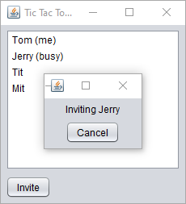
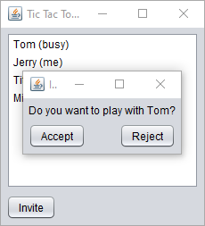
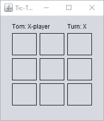
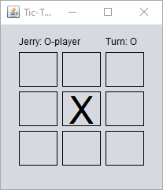
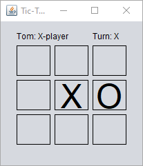

# Description
## Background
Tic-tac-toe (also known as Noughts and crosses or Xs and Os) is a paper-and-pencil game for two players, X and O, who take turns marking the spaces in a 3×3 grid. The player who succeeds in placing three of their marks in a horizontal, vertical, or diagonal row wins the game.
## Features
Tic-tac-toe game is a small game that allows two players to play over the network. Each player should join the tic-tac-toe room with a name. After joining the room, the player can invite the other to play with. The invited player should accept the invitation. For the first time, the game will randomly choose who is the X -player right after the invited accepts the inviting. When a game finished, a new game is started with the X-player is set to the player who was O-player in the previous game.
# Visuals
## Screenshots

\

